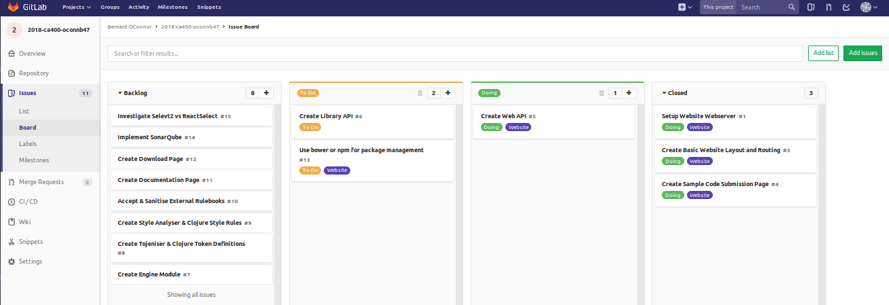
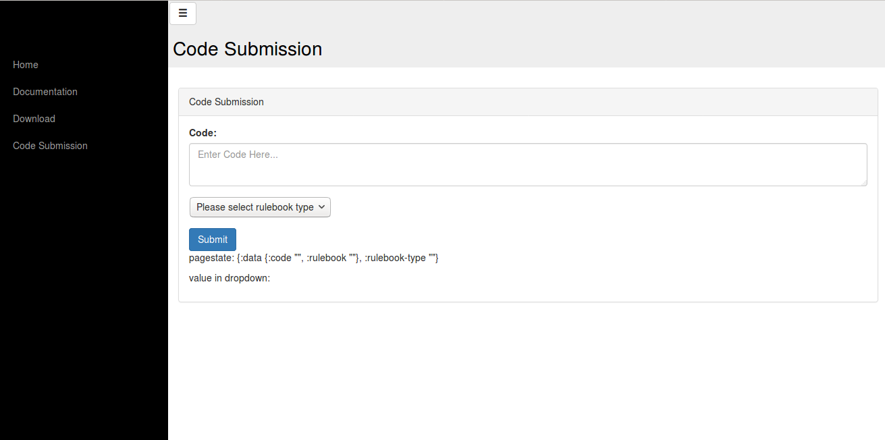

# Blog: Source-Code-Analyser-Engine

**Bernard O'Connor**

[TOC]: #

## Table of Contents
- [Blog Post 1 (01/11/2017)](#blog-post-1-01112017)
- [Blog Post 2 (19/11/2017)](#blog-post-2-19112017)
- [Blog Post 3 (21/11/2017)](#blog-post-3-21112017)
- [Blog Post 4 (25/11/2017)](#blog-post-4-25112017)
- [Blog Post 5 (29/01/2018)](#blog-post-5-29012018)
- [Blog Post 6 (05/02/2018)](#blog-post-6-05022018)
- [Blog Post 7 (12/02/2018)](#blog-post-7-12022018)
- [Blog Post 8 (19/02/2018)](#blog-post-8-19022018)
- [Blog Post 9 (26/02/2018)](#blog-post-9-26022018)
- [Blog Post 10 (05/03/2018)](#blog-post-10-05032018)
- [Blog Post 11 (12/03/2018)](#blog-post-11-12032018)
- [Blog Post 12 (18/03/2018)](#blog-post-12-18032018)


## Blog Post 1 (01/11/2017)

#### What I've Done:
My project, the Source Code Analyser Engine, has been approved.

I've met with my Project Supervisor, Dr David Sinclair, to discuss what needs to be done with my Functional Specification, which is the next deliverable for the project. 

I have started work on the Functional Specification for the project. I've talked about the business context for the project, and its future open source nature.

#### What I am Currently Doing:
I am currently fleshing out the User Characteristics and Use Case Scenario sections of the Functional Specification. Once I work out exactly what the User will wish to achieve with my system, it will be easier to design the required functionality to achieve these goals. 


#### What I Will Do:
Next I will work on the Functional Requirements for the Functional Specification. Also before my next Supervisor meeting I will try to create  an early mock up of the UI for the supporting website that I will be building for the Source Code Analyser Engine Project.


## Blog Post 2 (19/11/2017)
It has been a little while since my last blog post. The various assignments and working on the functional spec has kept me on my toes.

#### What I've Done:
I've fleshed out the Use Case Scenarios and the Functional Requirements some more.

While doing so I've come to a better understanding of my design. Before I was picturing developing two versions of my project, a web-process and an offline process.
While working on my Functional Requirements, I have realised that instead I should be making a java Library. The users of the project (who are all developers) will then make calls to the API of this library from their own web-processes / offline processes.
I have gone back to previous sections of my Functional Spec to make sure that this slight change of scope has been accounted for.


I also met with my supervisor last Thursday (16/11/2017). We discussed how much I should focus my functional specification on my main project vs example uses of my project, and about a sequence diagram I made, shown below.


#### What I am Currently Doing:
I am working on getting as much of the functional spec done for the next supervisor meeting on Tuesday, so I can recieve feedback before the due date on friday. Currently I am working on again adding more detail to the functional requirements and making some initial diagrams for the high level design.


#### What I Will Do:
Finish the Functional Specification for Friday.


## Blog Post 3 (21/11/2017)


#### What I've Done:
I had a meeting today with my supervisor to discuss the diagrams I have made since our last meeting. He was happy with them, though advised me to keep my state diagram for the technical manual.

###### \[Work In Progress\] Sequence Diagram for the SCAE Library


###### \[Work In Progress\] System Architecture Diagram


###### \[Work In Progress\] State Diagram Lexical Analyser


I also finalised the scope of my project, which I then discussed with my supervisor. At the heart of my project is the Source Code Analyser Engine library. What I've added to the scope is then a web-application that not only will host downloads and documentation for the library, but it will also have a public web API that other projects may easily point to.
These other projects will send a request with the source code to be analysed, and a string representation of the style rulebook and corresponding tokens to be used. This string representation can either be a URL to a raw version of a rulebook, the string may be the rulebook itself, or it may be an enum to point to one of my pre-approved rulebooks.

###### Rough Diagram to highlight new scope / full project architecture


#### What I am Currently Doing:
I am currently adding the final touches to the diagrams and reflecting the changes to the scope of the project in my User Scenarios and my Functional Requirements


#### What I Will Do:
Create a Gantt Chart and finish the Functional Specification for Friday.


## Blog Post 4 (25/11/2017)


#### What I've Done:
I finished and submitted the Functional Specification yesterday.

#### What I am Currently Doing:
Right now in college we are about to go into week 11 of the first Semester. My focus right now is to finish of the last 2 assignments that I have for the semester as soon as I can.

#### What I Will Do:
As outlined in the below Gantt Chart, before I break to focus on the first semester exams I would like to try and get the supporting website up and running to a very basic degree.
Mainly just to get the webserver running and to ensure that the routing between blank pages are working. Then I will break for the exams before coming back and getting stuck into the heart of the project.


## Blog Post 5 (29/01/2018)

#### What I've Done:
It is now Mondary of Week 1 of the Second Semester. Since the last update, I had not worked on the project before the exams as I had hoped.
Since the exams though, I have more or less caught up with where I plan to be in the Gantt Chart.
I set up an issues board on gitlab to keep track of which tasks I'm doing, referencing the issue number on each commit I make.




Then I setup setup the webserver using lein, the Clojure and Clojurescript project management tool.

Then I create a base layout of the website with a side navigation bar and defined routes for the pages in the backend handler.

Finally I created an initial code submission page for a user to enter both their code and select which rulebook to use. This page still needs to retrieve rulebooks and to then make a post request to the future Web-API of the project.



#### What I am Currently Doing:
I am about to start making a dummy Web-API that will have a similar structure to the final product. I want to create this to cement what kind of requests I'll need the library to be able to handle, and to test sending and recieving information to this RESTful API.


#### What I Will Do:
The next thing I need to do is organise a supervisor meeting to discuss what I have done so far and what should be my next priority. Per earlier discussions in our previous meeting, after I finish the basics of this website (after I finish my current task), the next step would be to start working on the main Source Code Analyser Library itself, and to leave development of the website for a while.


## Blog Post 6 (05/02/2018)

#### What I've Done:
It is now Monday of Week 2 of the Second Semester.

The first thing I did this sprint is to create an API endpoint for the Source Code Analyser Engine, that just returned the request that was made to it as a placeholder until I get the library processing and returning data. I had some issues with the dependencies of some of the middleware modules whose dependencies conflicted with the version of Clojure I was using, forcing me to rollback to an earlier version. Also I have currently disabled Anti-Forgery Token checks, as currently I don't want users to have to be logged in to access the SCAE API.

Then I looked at how I was managing my dependencies for the website sub-project. Initially I had it where any dev working on this project would have to manually download and install the dependencies in the resources folder.
After looking into a couple package-management tools such as bower and npm, I've decided to go with yarn, which works similarly to npm. The reason I chose yarn over npm was that yarn allowed me to easily define where I wanted my node_modules folder with my depenencies to be installed, which was a requirement of mine as I couldn't go with npm's default of the root folder of the project, instead I install them to the resources folder with the following command (assuming I am in the src/scae-website directory)
```
 yarn --modules-folder ./resources/public/node_modules/
```
This automatically installs all of the dependencies defined in the package.json to the specified directory.

Next I spent a day or two reviewing some of the later chapters of the [Clojure For The Brave And True](https://www.braveclojure.com/clojure-for-the-brave-and-true/) book, specifically the chapters dealing with clojure macros (Which allow you to access the AST of the Clojure Program itself as it runs and to manipulate said tree) and the concurrency in clojure chapters. I felt that familiarising myself with these concepts now would be beneficial as I move forward with the project.

Finally I created the Source Code Analyser Engine Library subproject (src/scae-library). Currently this library returns the value of any arguments passed to it. I then looked into installing the library locally, which you do by running
```
lein install
```
when in the src/scae-library directory. This compiles the library and installs it to the .m2 directory in the user's home directory, where leinigen (the build tool) stores its downloaded dependencies.
I then added the scae-library as a dependency for the scae-website project, and in the endpoint I created earlier I call the library's dummy function that returns the arguments passed to it, to ensure that I both compiled and imported the library correctly, which I did.


#### What I am Currently Doing:
Currently I am working on the Engine Module in the scae-library, which is what will keep track of and call the different submodules needed to analyse the code.

I am also reviewing what was discussed today with my Supervisor, David Sinclair, about which tasks I should prioritise next.


#### What I Will Do:
The tasks that we discussed that should be accomplished for next week are:
* Complete the Engine module
* Create the Tokeniser module
* Investigate the data structures required for the analysis (determine if Abstract Syntax Tree is necessary, and if so if there are any clojure library's that I can leverage for this processing)
* Begin work on the Symbol Table and the possible Abstract Syntax Tree

## Blog Post 7 (12/02/2018)

#### What I've Done:
It's now Monday of week 3.

In the last sprint I finished the creating the Engine module task,
the tokeniser task (plus tests), and investigating which data structures
need to be used (see issue #19 for the result). I am carrying forward
the tasks for the Symbol Table and Abstract Syntax Tree into the Sprint 4.

The tokeniser task proved to be challenging. I knew going in that I would
have the user input a token definitions list consisting of regexes for
the different tokens, along with the code to be analysed. I'll explain
my solution to this problem, which will be one line of clojure, in detail below
as clojure code can be hard to decipher without learning the language.
The rest of the tokeniser.clj contains a lot of collection (a data-structure)
manipulation that would take too long to explain in detail here.

The challenging
part was to perform these regex searches while preserving the ordering of
the tokens (if I iteratively/recursively did regex searches for each token,
I would lose the ordering of each token). I solved this in the following code fragment
```
(clojure.string/join "|" (map :regex (vals (:tokens tokens))))
```
To read the above code let us go from right to left. `(:tokens tokens)`
extracts the value of the key "tokens" from the following hash-map,
 ```
 {:tokens {:NEGATE {:regex "~", :type :token},
           :COLON {:regex ":", :type :token},
           :ID {:regex "(?:[a-zA-Z])+(?:[0-9]|_|[a-zA-Z])*", :type :token}}
 ```

where the value is a hash-map containing the keys for the tokens, and an inner
hash-map for each token containing the regex string and what kind of token
this is (either a regular token or a skip token).

This hash-map is passed to the vals function `(vals (:tokens tokens))`. This
creates a collection (a list) of the values for each key in the hash-map,
e.g `({:regex "~", :type :token}, {:regex ":", :type :token}, {:regex "(?:[a-zA-Z])+(?:[0-9]|_|[a-zA-Z])*", :type :token})`

We then pass this list into the following function `(map :regex (vals (:tokens tokens)))`.
The map function takes as parameters a function (in this case the keyword :regex
is being treated as a function that will extract the value of the key from a map)
and the list (referred to as a collection) that we've made previously. The map
function applies the given function to every element in the given collection, and returns
a LazySequence (a non-fully realised list) of every result. So in our example
we extract the value of the regex key (which is a string) from every single hash-map in the given list,
and put it into a lazy sequence.

Finally we get to the clojure string join method
`(clojure.string/join "|" (map :regex (vals (:tokens tokens))))` which combines
every string in the LazySequence together, separated by "|", which in regexes is the
OR operator. In subsequent lines of code, I use this string to perform one
single regex search for every kind of token that we have defined. This solves
the problem that we faced with trying to preserve the ordering of the regexes.

The reason why I chose to do my project in Clojure is highlighted by the above.
You are able to do a tremendous amount of data manipulation with very succinct code,
 which will be useful throughout this project as I perform the Source Code Analysation,
 manipulating various kinds of data structures such as Syntax Tables and Abstract Syntax Trees.

#### What I am Currently Doing:
I am just about to move onto the "Create A Symbol Table" task, which will
allow me to keep track of various things such as scope.

#### What I Will Do:
The next major task that I want to complete in Sprint 4 is to Create an
Abstract Syntax Tree.


## Blog Post 8 (19/02/2018)

#### What I've Done:

It is now Monday of week 4.
The first thing I did in the last sprint (sprint 4) was to update the structure of json
rulebooks that I will be reading in, to prepare for reading in production
rules along with token definitions. This involved updating the tests slightly
to ensure that they passed with the structure changes.

Last week I said that I was moving on to working on the Symbol Table. I quickly
realised that it would make more sense to do the Abstract Syntax Tree first,
so that I can properly test the different features of an Symbol Table. So
I moved the task (issue #18) back into Todo and started work on the Abstract
Syntax Tree (issue #20), which I am continuing to work on this week. I'll
outline the challenges that I've faced in designing the Abstract Syntax Tree
below, along with my proposed solutions.

##### Challenges with designing Abstract Syntax Tree:
* **How to represent a tree in a functional language:** Before when learning
about tree structures for myself it's always been in context of Object Orientated
Languages where you can make a node class. So I've spent some time looking at
the idiomatic way of representing a tree in Clojure, which is a series of pairs of
nested lists/vectors. The first value in the vector is the root node, the next
set of values in the vector are nested vectors, each representing the immediate
children of the root. Each of these nested vectors can then containing a value
representing the node and then a series of vectors representing its children.

* **How to parse through my tokenised code with user submitted/modular production rules:**
This is a large problem that I struggled with conceptually before breaking
it down into sub-problems

    * **Read in user submitted production rules:**
    I need this entire process to be modular so that I can read in the
    user submitted production rules so that I can support multiple languages
    with the project. The production rules will be clojure functions that
    will be read in as a JSON string, in the following example format, where
    scae-forward-declarations and scae-programs are functions that I will
    require to be implemented

        ```
        "productions" : {
            "scae-forward-declarations" : "(declare optional-lbr optional-rbr identifier number ...etc...)
            "scae-program" : "(defn scae-program [] [[(decl-list) (function-list) (main)]])",

                "optional-lbr" : "(defn optional-lbr [] [[:LBR] [[]] ])",
                "optional-rbr" : "(defn optional-rbr [] [[:LBR] [[]] ])",
                "identifier" : "(defn identifier [] [[:ID]])",
                "number" : "(defn number [] [[:NUM]])",
                ... etc ... }
        ```
        The first thing I will do is read in the value for forward
        declarations as a string, convert it to clojure code, then evaluate this.
        This is because clojure requires all functions to either be defined before
        they are used, or to be forward declared, and with the nature of the inter-connections
        of production rules, I have found it necessary to declare them in
        advance in the rulebook and then invoke that with the following
        code within the library
        ```
        (eval (read-string (:scae-forward-declarations production-rules)))
        ```
        The last step in reading in the user submitted code is to then
        evaluate all of the function definitions with the following code
        ```
        (map #(eval (read-string %)) (vals production-rules))
        ```
    *  ***What format should the production rules take:*** As I've stated
    before the production rules will be clojure code. These productions rules
    will be called by some sort of parse method in my library, to see if the
    next set of tokens in the tokenised stream match. Currently I've decided
    that I want the production rules to return nested (possibly lazy so as not to
    evaluate function calls that may end up not being used) vectors
    of the possible tokens that could match the production. The outer vector will
    contain a series of vector , with each of these inner vectors containing a
    series of either tokens or calls to other production rules, or if a vector
    is empty I will take that as an epsilon production. Each inner vector
    represents a different set of tokens that could match a production.

        Let's look at some examples to clarify:
        ```
        (defn binary-arith-op
        []
        [ [:PLUS_SIGN]
          [:MINUS_SIGN] ])
        ```
        In this example, binary-arith-op is a function that takes no
        parameters and returns a nexted vector. Here we are saying that
        a PLUS_SIGN token **OR** a MINUS_SIGN token are valid tokens to
        be resolved by the binary-arith-op production rule.

        ```
        "(defn function-list
        []
        [ [(function) (function-list)]
          [[]] ])"
        ```
        In this example function-list is a function that takes no parameters.
        The first option in the nested vector are two function calls, which
        will be resolve the tokens defined in "function", and then recursively
        call function-list.
        The next option "[[]]" is an empty vector, which I intend to use
        to signify an epsilon production (this will end the recursion/allow
        the function list to be empty).

* ***Parse through the tokens/production rules:*** I have not yet gone to
implement this, but here is an overview of my plan. In the library I will
have a Parse function that will take in the list of tokenised code and a
production function. I will call this production function (which initially
will be "scae-program", which acts as my entry point to the producion rules)
to get the (lazy) vector of tokens to be match, and begin matching the
tokenised code to the result of the production call. As described above,
the production call returns a nested vector, with each inner vector
represent an OR choice of a valid set of tokens for the production, so I
will check each inner vector in order until I either find a successful
match or failure.

    Each inner vector could itself contain a call to another production
    rule, for which I will recursively call Parse with the remaining tokens
    to be processed and the production rule in question.

    If I can successfully parse the tokens returned, I will add the production
    rule as a node to the Abstract Syntax Tree. If I can't match the tokens,
    at the moment I am currently debating if I should throw an error, or
    to stop parsing and just use what I've successfully parsed up to that
    point, or a combination of the two.


#### What I am Currently Doing:
I am currently moving onto implementing my proposed solution to the parsing
issue for the Abstract Syntax Tree.

#### What I Will Do:
As outlined in my supervisor meeting today, my main goal this week is
finish creating the AST and to demonstrate it in action for the next
meeting on Monday. I believe this will take up most of the time for this
week. If I do have any extra time, I will move onto generating a symbol
table.


## Blog Post 9 (26/02/2018)

#### What I've Done:
It is now Monday of Week 5.

I have split the task of creating the AST into two parts. The first is
to parse through the production rules for the tokenised code. The second
is to create nodes for these production rules and to add them to the AST.

At the time of writing this blog I have nearly finished parsing the
production rules, but have yet to push those changes to gitlab. I am able
to correctly parse two out of three of my test programs at the moment, and
I want to correctly parse the third program before committing.

I've kept the same general design that I outlined in the previous blog
for the design of the parser. In the `parse-production-rule` function I
recursively go through every inner nested vector (the OR option vectors),
calling the `parse-single-option` function, passing in the remaining
tokens to be parsed and the option-vector itself.

In this function I recursively check if the head of the remaining tokens
matched the head of the option vector.

* If the head of the option-vec is a function call, I recursively call
the `parse-production-rule` func with the same tokens and the function call.
If that call is a successful match, I remove the tokens returned from that
call from my current remaining tokens to be parsed, and then continue parsing
the rest of the current option-vector.

* If the two heads match I recursively call the function
with each head removed, and then return the head (the matching token-key).
This returned head will recursively build up a lazy-sequence of every token
that was matched.

* If the head of the option-vector is an empty vector, I treat this as an
Epsilon (empty) match. I return empty vector, which means that this is a valid
match while not consuming the current token, so that I can try to match that
token with another value later.


* If the heads don't match I return `nil`, which means that this particular
option-vec doesn't match.

In the `parse-production-rule` function, I analyse these option vectors in
order.

* If any one of them match (return a lazy-sequence of matched tokens
instead of nil), then the production rule is matched, and I return those
tokens.
* If multiple are matched, I return the tokens from the first matching
option.
* If none match, I return nil for failure.


Below I'll outline some of the challenges that I've faced so far with
implementing the parsing of the production rules.

##### Challenges with Parsing the Production Rules:

* **How to handle issue with the namespace of the production rules:**

    In the last blog I outlined how I was reading in and forward declaring
    the production rules. While this method worked well in a REPL (Read
    Eval Print Loop) terminal, I was facing some issues with calling this
    code from my internal library code. I was having issues calling the
    first production rule from my code as at the time of compilation, even
    when I forward declare the production rule, the function does not exist
    at all until midway through runtime.

    I got around this by creating another key-value pair in my rulebook.
    The key is `:scae-entry-point` and it has a value of `"(scae-program)"`,
    which is a function call in string form. I am able to read this string
    in and evaluate it, which let me call the production.


* **How to handle recursive production rules:**

    Many of the production rules require recursive calls in order to get
    the tokens that I am matching the tokenised code to. To prevent infinite
    recursion, I initially though that I could use lazy sequences, to prevent
    values from being evaluated before I needed them. In actuality this
    did not work, as with the way I was parsing, all of the values were
    being calculated, and then cached into the lazy sequence, which meant I
    still had the infinite recursion problem.

    The solution was to "quote" every function call in the production rule
    in the rulebook itself. Quote is a macro that tells the Clojure compiler
    not to evaluate the next symbol/expression, and to instead pass the
    unevaluated symbol.

    For example if I had a function `foo` that took
    an int as a parameter, I could call `(foo (+ 1 2))` which would
    evaluate to `(foo 3)`. If I quoted the plus operation (using apostrophe
    as shorthand for (quote)), `(foo '(+ 1 2))` would pass in a list
    containing the elements +, 1, 2 to the function foo. I can call `eval`
    on this list to evaluate the expression and get the value 3.

    So in my production rules, I quote every function call in the nested
    vectors (outlined in the previous blog). This means that in every nested
    vector any function calls are essentially turned into lists. This allows
    me to check if the current element of the nested vector that I am parsing
    is a funtion (a list), if so then I can evaluate it then and recursively
    call my parse function on it **only when I am ready to parse it**.
    This prevents the problem of every recursive function calling itself
    infinitely before I can parse it and either accept or reject the production
    rule, ending the recursion.

    An example of this in in a production rule is
    ```
    "var-decl" : "(defn var-decl [] [[:VAR '(identifier) :COLON '(data-type)]])",
    ```
    So when the var-decl function is called, it will not evaluate the
    `(identifier)` or `(data-type)` function calls, which would themselves
    evaluate to nested vectors. This allows me to deal with each element of
    the vector separately, and only evaluate those functions when I get to
    that element. In the case of where my parse fails at `:VAR`, I can discard
    the rest without ever having to call those functions.

* **ID regex in my sample rulebook:**

    When testing the parser I noticed that it was failing many of the rules
    due to the regex I had defined for the ID. The ID was capturing all of
    the keywords of the CCAL language as ID tokens instead of their respective
    tokens. This is the old regex for ID that was causing the issue
    ```
    (?:[a-zA-Z])+(?:[0-9]|_|[a-zA-Z])*
    ```

    which was capturing every word, regardless of whether or not there was
    a later regex for specific keywords

    Currently this regex, which specifically excludes the indiviual keywords,
    seems to have solved this issue
    ```
    (?!var|const|return|integer|boolean|void|main|if|else|true|false|while|begin|end|is|skip)(?:(?:[a-zA-Z])+(?:[0-9]|_|[a-zA-Z])*)
    ```


#### What I am Currently Doing:

As stated above I am currently finishing parsing the production rules.
Specifically at the moment I am debugging my parser for the following code input
```
var i:integer;
integer test_fn (x:integer) is
  var i:integer;
begin
  i = 2;
  return (x);
end

main
begin
  var i:integer;
  i = 1;
  i = test_fn (i);
end
```
which is failing the parsing when reading in the 2. I believe this to be
 a production rule side bug and not a library bug, as I am able to parse
 some other code inputs. I should resolve this issue relatively quickly,
 at which point the production rule parsing side of the AST generation will
 be done.


#### What I Will Do:

Once I finish the parser I need to create nodes for the production rules
and add them to the AST. Currently I intend to either have the node
information for the production rules to either be meta-data, or else I will
alter the data structure of the return of the parser to include the node
information along with the token keys matched.

From my meeting with my supervisor today, I will also start investigating
compiling a testing plan, to complement my workflow of creating integration
tests as I add a new feature.


## Blog Post 10 (05/03/2018)

#### What I've Done:
It is now Monday of week 6. I have finished both the tasks for parsing the
production rules (issue #22) and from that generating the Abstract Syntax Tree
(issue #20). This is a major milestone for the project, as I am now able to
read in code alongside a provided rulebook, parse it, and understand the
structure of it in a modular, programmatic fashion. From this milestone,
the next milestone will be to start detecting possible improvements and
returning those suggestions.


##### Challenges with Parsing the Production Rules:

* **Handling inner OR statements within an option-vector:**

    Last week I mentioned that I was debugging an issue I had parsing one
    of my test inputs. The issue stemmed from production rules that have
    an inner OR statement within the a production option. The library currently
    expects production rules to be in the format `optionA OR optionB OR etc...`.
    It runs into difficulties with formats like
    `(sub-optionA1 OR sub-optionA2) OR optionB OR etc...`. Currently I have
    gotten around this issue by restructuring my production rules to the first
    format. I will review adding support for the second format at a later date
    when the project is feature complete. So to make format2 into format1
    we change `(sub-optionA1 OR sub-optionA2)` to a function call, where the
    function is in the first format of `optionA1 OR optionA2`.


##### Challenges with Generating the Abstract Syntax Tree:

* **Deciding on AST Node Format:**

    Up to this point, my focus was parsing the production rules, and to
    return the tokens that were parsed. Now I needed to decide on the format
    I wanted the AST nodes to take. As mentioned last week, I was entertaining
    the idea of having the tokens parsed by a production rule to be placed in
    its own vector, and to apply meta data to that vector with the AST node
    name. The problem that I ran into with this approach was with the
    immutable nature of Clojure data structures coupled with my method of
    parsing recursively through the tokens, which resulted in new/copied vectors
    to be created that would not retain the meta data of the original vector.

    With the meta data approach ruled out, I decided to change the data
    structure that the parsing returns. Instead of just returning the tokens
    parsed my the production rule, I decided to return a map containing the
    name of the production and a list of the tokens parsed by the rule.

    To do this I altered my `eval-code` function, which took in either a
    string or clojure symbol and evaluated to a piece of clojure code (which
    would be a clojure function returning the possible tokens for that
    production rule) and changed the function to `code->node`, which is the
    Clojure idomatic way of naming a function that converts one datatype to
    another.
    ```
    (defn code->node
      [code]
      (let [unevaled-code (if (string? code)
                            (read-string code)
                            code)]
        (hash-map :node-name (name (first unevaled-code))
                  :node-value (eval unevaled-code))))
    ```
    This code can take in a string or a symbol (if it's a string I convert it
    to a symbol with `read-string`, in the format "(production-rule-name)".
    I then return a hashmap containing the name of node (the name of the
    production rule), and the node-value (the evaluated result of the production
    rule).

    The next step was to then alter the areas of the code that expected
    a collection of tokens that were parsed by a production rule to point to
    the value associated with the :node-value key of that map.


* **Issue of mismatch of the current token with the remaining tokens available
in the option vector:**

    Leading on from the previous issue, once I implemented the new data-structure
    I started having an issue with parsing certain sample programs. I would
    get halfway through the program, generating the correct nodes throughout,
    when suddenly I would run out of option tokens to compare with the current
    token I was parsing.

    The issue lay in one section of the code, right after I parse a function
    call that is within an option-vector, I drop the tokens that were matched
    by the function from the list of tokens to parse, then I continue parsing
    the rest of the remaining tokens with the remains of the option-vector.

    The old code
    ```
    (parse-single-option (drop (count inner-func-recursive-result) tokens) (rest option-vec))
    ```

    In the old code, I was dropping the count of tokens previously matched from
    the remaining tokens to be matched. The `count` function was taking
    the count of the tokens matched. I forgot to account for the new
    data-structure here, where the previously matched tokens are now in
    a heavily nested hash-map. I researched the idiomatic way of counting
    the instances of a particular keyword in a heavily nested hash-map of
    lists, where the lists could either contain another list or another
    nested hash-map. I found and implemented the following, modified for
    my own use case:
    ```
    ;; Credit for the function count-tokens: https://stackoverflow.com/a/48389794
    (defn count-tokens
      [coll]
      (->> coll
           (tree-seq coll? seq)
           (keep #(get-in % [:token-key]))
           count))
    ```

    With that count-tokens function, the original problematic code now
    looks like this:
    ```
    (parse-single-option (drop
                            (count-tokens (:parsed-node-result inner-func-node))
                            tokens)
                            (rest option-vec))

    ```

    With this problem solved, I could now generate ASTs.


For the following sample code
```
void func () is
begin
  return ();
end

main
begin
  func ();
end
```

I get the following AST using the sample-rulebook.json
```
Printing Abstract Syntax Tree:
{:parsed-node-name "scae-program",
 :parsed-node-result
 ({:parsed-node-name "decl-list", :parsed-node-result []}
  {:parsed-node-name "function-list",
   :parsed-node-result
   ({:parsed-node-name "function",
     :parsed-node-result
     ({:parsed-node-name "data-type",
       :parsed-node-result
       ({:token-key :VOID, :token-value "void", :token-type :token})}
      {:parsed-node-name "identifier",
       :parsed-node-result
       ({:token-key :ID, :token-value "func", :token-type :token})}
      {:token-key :LBR, :token-value "(", :token-type :token}
      {:parsed-node-name "parameter-list", :parsed-node-result []}
      {:token-key :RBR, :token-value ")", :token-type :token}
      {:token-key :IS, :token-value "is", :token-type :token}
      {:parsed-node-name "decl-list", :parsed-node-result []}
      {:token-key :BEGIN, :token-value "begin", :token-type :token}
      {:parsed-node-name "statement-block", :parsed-node-result []}
      {:token-key :RET, :token-value "return", :token-type :token}
      {:parsed-node-name "optional-lbr",
       :parsed-node-result
       ({:token-key :LBR, :token-value "(", :token-type :token})}
      {:parsed-node-name "optional-expression", :parsed-node-result []}
      {:parsed-node-name "optional-rbr",
       :parsed-node-result
       ({:token-key :RBR, :token-value ")", :token-type :token})}
      {:token-key :SEMI_COLON, :token-value ";", :token-type :token}
      {:token-key :END, :token-value "end", :token-type :token})}
    {:parsed-node-name "function-list", :parsed-node-result []})}
  {:parsed-node-name "main",
   :parsed-node-result
   ({:token-key :MAIN, :token-value "main", :token-type :token}
    {:token-key :BEGIN, :token-value "begin", :token-type :token}
    {:parsed-node-name "decl-list", :parsed-node-result []}
    {:parsed-node-name "statement-block",
     :parsed-node-result
     ({:parsed-node-name "statement",
       :parsed-node-result
       ({:parsed-node-name "identifier",
         :parsed-node-result
         ({:token-key :ID, :token-value "func", :token-type :token})}
        {:parsed-node-name "statement-prime",
         :parsed-node-result
         ({:token-key :LBR, :token-value "(", :token-type :token}
          {:parsed-node-name "arg-list", :parsed-node-result []}
          {:token-key :RBR, :token-value ")", :token-type :token}
          {:token-key :SEMI_COLON,
           :token-value ";",
           :token-type :token})})}
      {:parsed-node-name "statement-block", :parsed-node-result []})}
    {:token-key :END, :token-value "end", :token-type :token})})}
```


The program works for more complex pieces of code, but as you could imagine
from the simple example above, its Abstract Syntax Tree is rather large, so
I won't post it here.

#### What I am Currently Doing:
Currently I am about to create tests for the Abstract Syntax Tree generation.


#### What I Will Do:

I will then move onto creating the symbol table, and depending on time this
week look into beginning work on the style rules.


## Blog Post 11 (12/03/2018)

#### What I've Done:
It is now Monday of week 7.

I have made significant progress on creating the Symbol Table (task #18).
I have created the coded all of the functionality needed for a Symbol Table
to function.

A Symbol Table is used to track certain information about different symbols,
such as what scopes that symbol is available in.

I have implemented the ability to change the current scope, while optionally
keeping track of previous scopes by pushing them to a stack before updating the
current scope. I also have the functionality to pop off a previous scope and
set it as the current scope again. For each scope I can keep tracks of all of the
symbols in it, using is a nested hash-map of hash-maps to keep track of the
symbol name and value under its respective scope-name.


#### What I am Currently Doing:

Currently I am working on building the Symbol Table during a parse. I
have run into some challenges with this, which I think I have a valid solution
for that I want to implement.

##### Challenges with Building The Symbol Table:

* **When to build the table to avoid branches of execution that were never
taken, thus polluting the Symbol Table:**

    Initially I was considering building the Symbol Table in the same parse
    that I built the Abstract Syntax Tree. The issue here is that during
    the parsing for the Abstract Syntax Tree we visit multiple possible
    nodes, and then discard the nodes that do not match our input stream.
    If I were to build up the Symbol Table in this Parse, there would be
    additions to the Symbol Table made from nodes that were never executed.

    My proposed solution is to do two parses, one to build the AST from the
    submitted code, the second to build the Symbol Table from the completed
    AST. In the user defined AST nodes I would include optional Symbol Table
    function calls that would be ignored by the AST when it performs a pretty
    print.

    These optional Symbol Table function calls would only be evaluated in
    the second parse, so that they can build the correct Symbol Table.

#### What I Will Do:
Once I finish the Symbol Table I will do some testing before moving onto
working on style rules.


## Blog Post 12 (18/03/2018)

#### What I've Done:

It is now Sunday of Week 7. I'm writing this blog post early as tomorrow
is a bank holiday so it won't be until Tuesday that I see my supervisor
again, and I need to spend most of tomorrow studying for class tests.

I have finished Task #18 , Create a Symbol Table. Last week I talked about
the functionality of the Symbol Table, and now I can build that Symbol Table
by doing a parse of the previously generated Abstract Syntax Tree.

##### Challenges with Building The Symbol Table from the Parse:
* **Accessing the correct token values to add to the symbol table mid-parse
from the user submitted rulebook:**
This was the main challenge I found when generating the Symbol Table while
parsing the Abstract Syntax Tree.

    For Example, for a variable-declaration node I want to access the ID
    token to add it to the symbol table. Here is the corresponding Abstract
    Syntax Tree node.
    ```
    {:parsed-node-name "var-decl",
           :parsed-node-result
           ({:token-key :VAR, :token-value "var", :token-type :token}
            {:parsed-node-name "identifier",
             :parsed-node-result
             ({:token-key :ID, :token-value "i", :token-type :token})}
            {:token-key :COLON, :token-value ":", :token-type :token}
            {:parsed-node-name "data-type",
             :parsed-node-result
             ({:token-key :INT,
               :token-value "integer",
               :token-type :token})})}
    ```
    Notice that the ID token is in a nested AST node called `identifier`.

    I needed to figure out a way to reference the values that I wanted from the
    rulebook. As discussed in the previous blog, I made an optional
    `st-func-calls` token that is put into the AST. This token contains
    the symbol table function calls (which can be anonymous function calls
    that call symbol table functions) that I will evaluate from the Symbol
    Table namespace.

    For the above example, I pass to an anonymous function the list of
    tokens in the root `:parsed-node-result`, and call this list `ast-entry`.
    I then use the following code snippet to access the value of the ID token

    ```
    (:token-value (nth (:parsed-node-result (nth ast-entry 1)) 0))
    ```
    To break this down, I
    * Select the ID AST-node with `(nth ast-entry 1)` (which for this production
    rule will always be in the second position on the list).
    * I then select its list of tokens with `(:parsed-node-result (nth ast-entry 1))`
    * Then we select the desired token (in this casealways in the first position)
    with `(nth (:parsed-node-result (nth ast-entry 1)) 0)`
    * Finally we then get the value of the desired token with `(:token-value (nth (:parsed-node-result (nth ast-entry 1)) 0))`

    The above code gets the name of the symbol that we wish to add to the
    Symbol Table. We do something similar to get the value of the symbol.
    Then with the following snippet we can add that symbol name & value to
    the current scope
    ```
    (st/add-to-scope name {:symbol-name name :symbol-value value})

    ```

    Below is the full entry for the `var-decl` production rule in the user
    submitted rulebook that I am creating to test out my project
    ```
        "var-decl" : "(defn var-decl []
                    [[:VAR '(identifier) :COLON '(data-type)
                    {:st-func-calls [(fn
                                      [ast-entry]
                                      (let [name (:token-value (nth (:parsed-node-result (nth ast-entry 1)) 0))
                                           value (:token-value (nth (:parsed-node-result (nth ast-entry 3)) 0))]
                                           (st/add-to-scope name {:symbol-name name :symbol-value value})))]} ]])",

    ```

    I have taken it upon myself to format the above example. In the actual
    rulebook that I am creating, that above example is all
    on a single line without any sort of indentation, as the value is a string
    and I can't have multi-line string when writing  sample-rulebook.json file,
    as specified by the JSON format.
    As you can imagine that can get rather annoying with having to deal
    with such long single line production rules, especially as now I have to
    write anonymous functions as part of those single lines.

#### What I am Currently Doing:
Currently I am studying for some class tests that will take place mid-week
this week. After that I will resume work on the Final Year Project.

#### What I Will Do:

I will meet with my supervisor again on Tuesday as mentioned earlier. We will
discuss which tasks should take precedence next. I believe it will be to start
working on defining and returning style suggestions to the user, which I envision
will take a couple weeks.